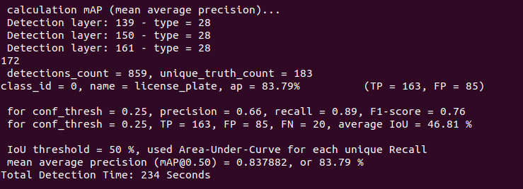
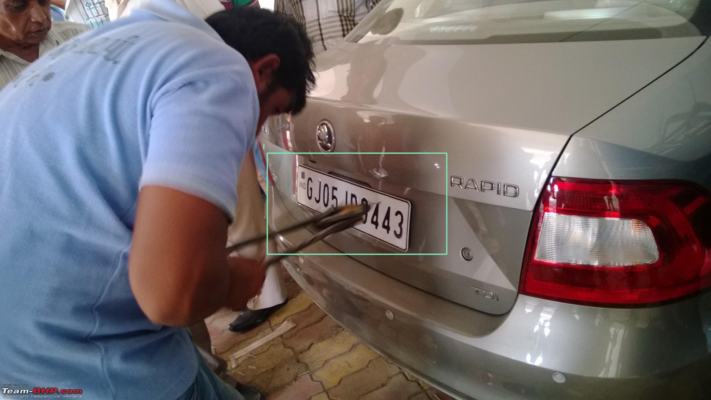
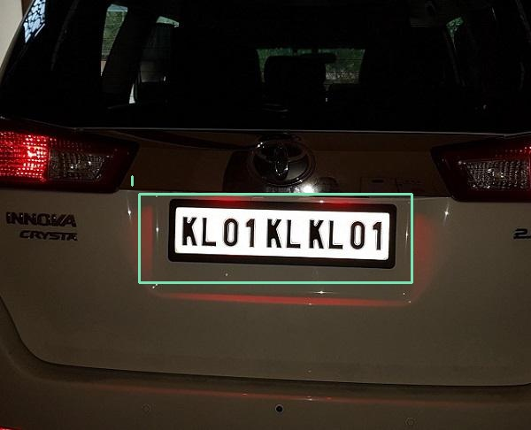
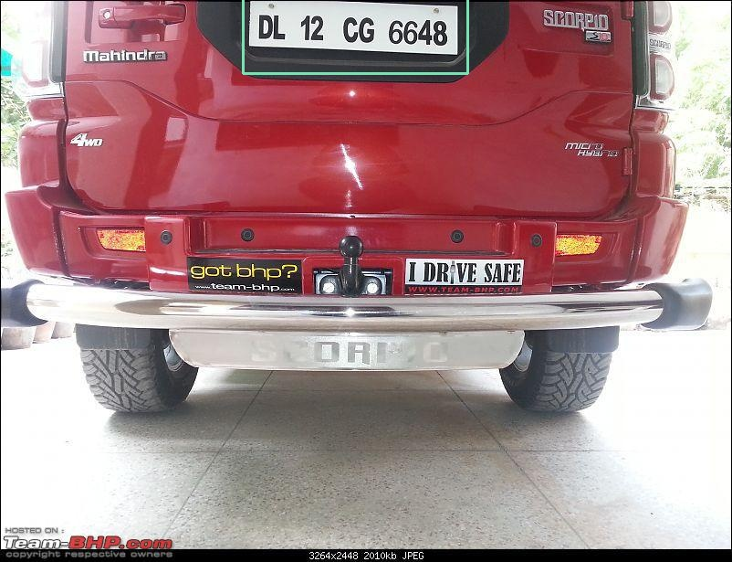
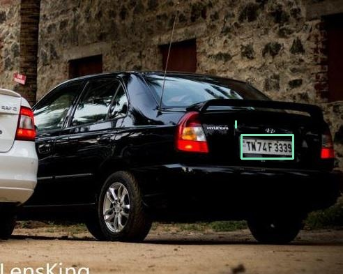

# yolo_task

## Automatic Number Plate Detection Using YOLOv4(darknet)
- Input Images:     ` inference_images ` folder
- Output Images:    ` output_images ` folder
- mAP - 83.79%

### Steps to Run Test Script:

- ` pip install -r requirements.txt`

- `python test.py --config yolov4-custom.cfg --weights yolov4-custom_1000.weights` 

Sample Results of detection: 

