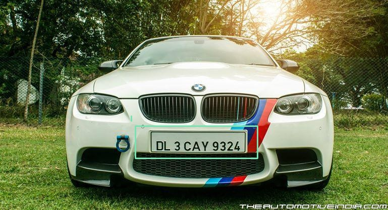

# yolo_task

## Automatic Number Plate Detection Using YOLOv4(darknet)
- Input Images:     ` inference_images ` folder
- Output Images:    ` output_images ` folder
- mAP - 83.79%
## For YOLOv4 Model
Click here:  [Model](https://drive.google.com/drive/folders/1iedvPfZ9tcKVqXcjuZdUuc5vrBA8F2Vv?usp=sharing)
## For Weights
Click here: [Weights](https://drive.google.com/file/d/1ZdVUK09Hez6YJt5P1966VOv6sDQNr8jS/view?usp=sharing)

### Steps to Run Test Script:

- ` pip install -r requirements.txt`

- `python test.py --config yolov4-custom.cfg --weights yolov4-custom_1000.weights` 

### Sample Results of detection: 

